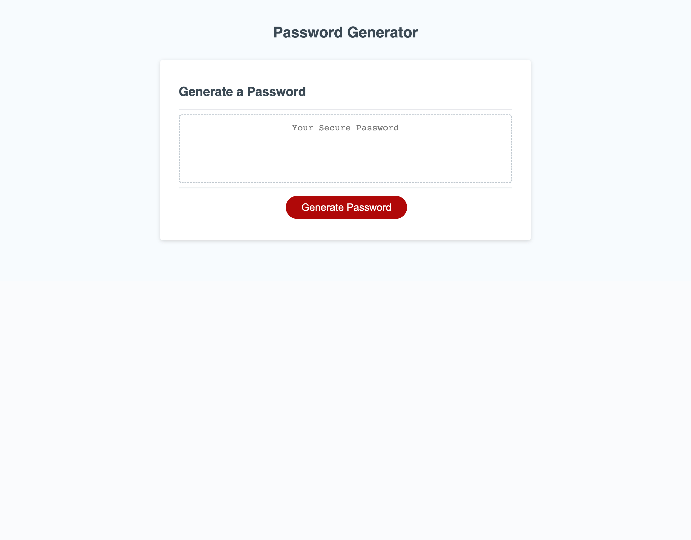

# Random Password Generator

## Description

This webpage provides a random password generator to users who wish to select how long their password is and whether they want to include lowercase, uppercase, numeric, and/or special characters.

## Usage

Clicking on the 'Generate Password' button will invoke a series of prompts asking the user the preferred length and what character types to include. The generated password will then appear in the box.

## Screenshot

## Link

[https://jaredbartos.github.io/password-generator](https://jaredbartos.github.io/password-generator)